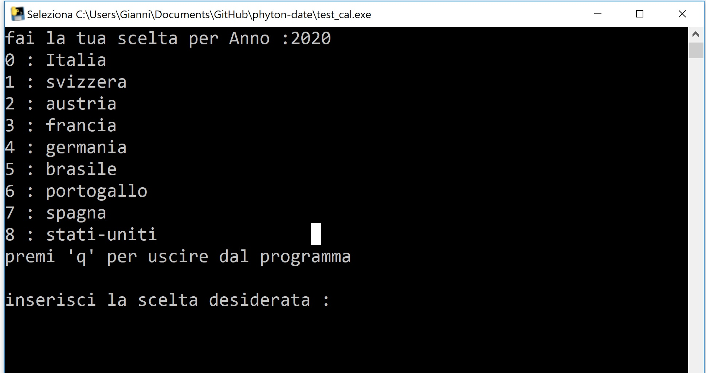
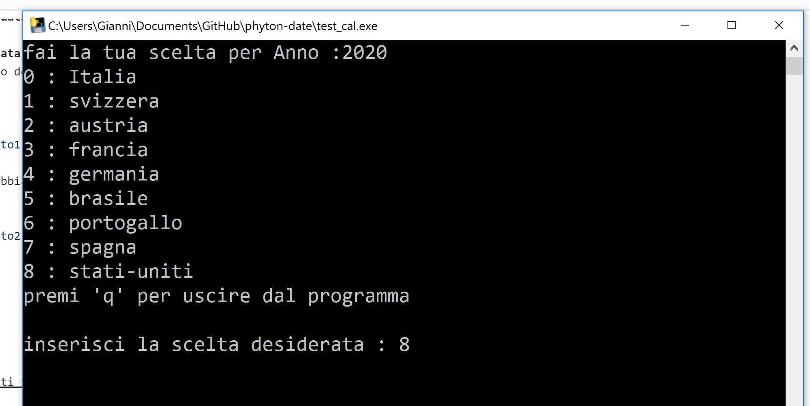
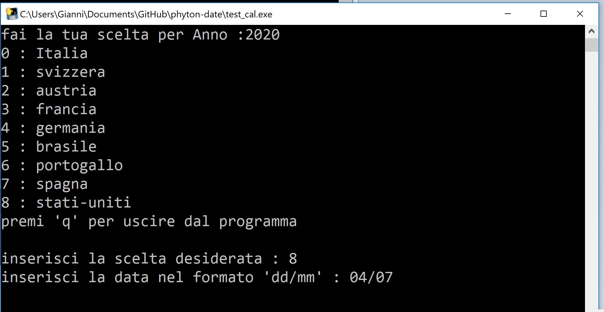
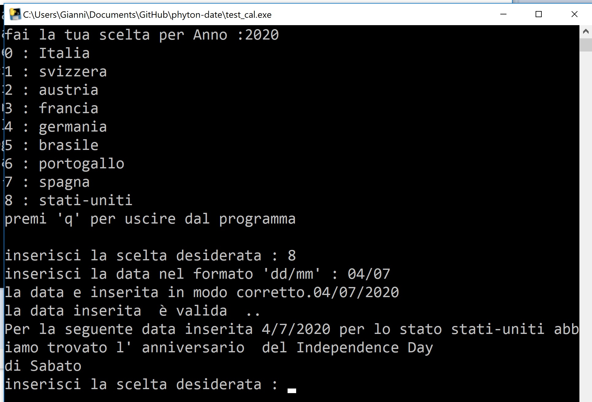

# Confronto di una data nel formato giorno/mese del anno attuale Utilizzando Pyhton 3.8

### Inserisco una data nel formato dd/mm su una scelta di stati per cercare se quella data appartiene ad una festività o ad anniversario 
 *  Indica il giorno della settimana ad esempio "Sabato" o "Domenica" o "Lunedi"

 

  

  *  come si nota abbiamo delle scelte tramite questo menu 

 

  

 *  Selezionandouno stato selezionato interroghiamo il file che ci viene ritornato dalla seguente pagina web
 *  "https://giorni-festivi.eu"
 verrà preso e processato.
 * la prima cosa che fa è quello di controllare inserimento corretto della opzione di scelata e della formattazione della data

 

  

*   una volta controllato parte un ciclo che recupera le eventuali occorrenze con una festivita nazionale
 se la trova viene sttampato l'occorenza viene indicata se il giorno trattato è di Sabato o di Domenica o un giorno 
 feriale

 

  

si esce dal programma premendo q

### Librerie Aggiunte in Phton nel progetto
 
 

C:\Users\Gianni>pip list
 *  Package         Version
 *  altgraph        0.17
 *  arrow           0.14.7
 *  certifi         2020.6.20
 *  chardet         3.0.4
 *  future          0.18.2
 *  icalendar       4.0.6
 *  ics             0.7
 *  idna            2.10
 *  numpy           1.19.0
 *  pandas          1.0.5
 *  pefile          2019.4.18
 *  pip             19.2.3
 *  PyInstaller     3.6
 *  python-dateutil 2.8.1
 *  pytz            2020.1
 *  pywin32-ctypes  0.2.0
 *  requests        2.24.0
 *  setuptools      41.2.0
 *  six             1.15.0
 *  TatSu           5.5.0
 *  urllib3         1.25.9

Esistono varie definizioni per il controllo dell'inserimento delle date e sulla digitazione corretta delle scelte sul menu
   
    def is_size(check_input,size_menu):
    '''
    funzione che controlla se hai inserito un numero piu grande delle opzioni di scelta
    '''
    #print(repr(check_input))
    #print(repr(size_menu))
    if check_input < size_menu :
        return True
      return False
      
      def is_digit(check_input):
      '''
      function che controlla se la stringa digitata e un intero
      bool
    '''
    if check_input.isdigit():
      return True
     return False
    
    
    
   
* Tramite un request carichiamo il file calendairio
testo = requests.get("https://giorni-festivi.eu/ical/"+stati_list[int(user_input)]+"/"+str(anno_check)).text
               
                trovato_giorno_festivo=False;
                trovato_giorno_lavorativo=False;
               
                #print ("testo")
                #print (testo)
                #print ("***********")
                gcal = Calendar.from_ical(testo)
                size=0
                for component in gcal.walk():
                    if component.name == "VEVENT":
                        size=size+1
                #        print (str(size)+" "+component.name)
                #        gcal = Calendar.from_ical(testo)
               
                indice=0
               
                
                
                for component in gcal.walk():

                 if component.name == "VEVENT":

                    indice=indice+1
                    descrizione = component.get('SUMMARY')
                    #print(descrizione)
                    date_start = component.get('DTSTART')
                    #print (date_start.to_ical())
                    date_end1 = component.get('DTEND')
                    #print (date_end1.to_ical())
                    date_time = component.get('DTSTAMP')
                    #print (date_time.to_ical())
                   
                    mese_check=date_start.dt.month
                    giorno_check=date_start.dt.day
                    #print (trovato_festivita)

                   
                    #main_festivita(indice,size,
                    #               trovato_giorno_festivo,trovato_giorno_lavorativo,
                    #               anno_check,mese_check,giorno_check,anno_check,
                    #               int(month),int(day),int(year),
                    #               descrizione,stati_list[int(user_input)])
                    main_festivita(indice,size,
                                   trovato_giorno_festivo,trovato_giorno_lavorativo,
                                   anno_check,mese_check,giorno_check,anno_check,
                                   int(month_me),int(day_me),int(year),
                                   descrizione,stati_list[int(user_input)]) 

    

* [ qui per il donwload del file opzione Salva oggetto con nome]( target/EsempioFreeMarkerH2-0.0.1-SNAPSHOT.jar)

